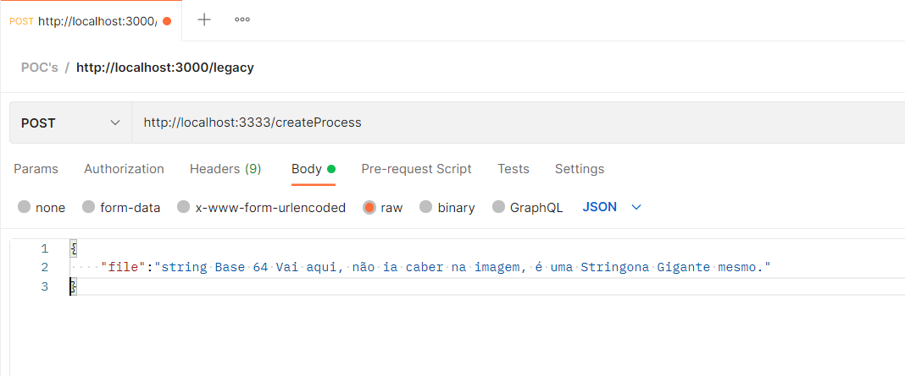

# convert-stringBase64-ToExcel-ToJson

## Payload que deve ser enviado ao EndPoint, Na Raiz do Projeto existe arquivo txt com o arquivo excel em base64

## Excel que deve ser Gerado no Servidor ao Enviar a StringBase64

## Estrutura Json Gerada através da Leitura do Excel que está no Server - Utilizado Lib xlsx

Ignorem as escritas dos Print's rs. Só uma mera brincadeira.
